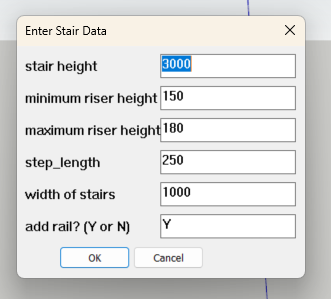
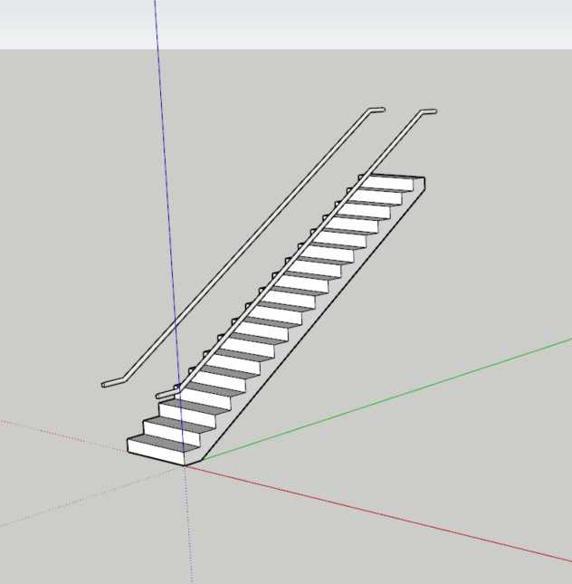

# SketchUp: Stairs Generator

## What's this?

Ruby code for auto generating a staircase, in SketchUp 

All you need to know are:  

The height of the stairs (from the ground to the next level)  
The minimum and maximum heights for each step (from building code, preferably)  
The length for each step  

## How to Use
From top bar of SketchUp UI:  
Extensions > Developer > Ruby Console   
Load .rb file from save location by inputting load plus file location.  
Ex. "load C:/[username]/[script name.rb]"  

Or copy-paste stairs.rb file contents to console.  

Then hit Enter. 

## Usage / Instructions

Upon running the code, a prompt box appears with default values for the following:  

stair height (floor to top of stair, mm)  
minimum riser height (mm)  
maximum riser height (mm)  
step length (mm)  
width of stairs (mm)  
add rail (Y or N?)  

Edit desired values and click OK.   
A window showing stair data appears. click OK.  
A stair group will be generated with the desired values.   

Entering 'y' for the 'add rail' option will generate 50mm diameter rails. These will be
900mm O.C above the stair steps, and extend 300mm horizontally from the ends of the stairs. 

## What the code actually does

Steps:  
1) Divide height by the average of the min and max riser heights to get number of steps 
2) Distribute remainder of quotient to risers, such that heights are evenly distributed
in reasonable dimensions. In this process all riser heights will be equal, except the first  
3) Draw a (poly)line surface tracing the stair outline. 
4) Extrude this surface to set the stair width 
5) Railings: get and move stair points, then extrude a circular surface perpendicular to these points.  
6) Transform stair into component for ease of use.   

## Log

### 08/03/2025
Code complete  
possible TODO: group rails  
Added licence and updated readme.md

### 08/03/2025
Base code input generates stairs and railings  
TODO: 
Options: to put railings or not 
Refining railing to fit on stair edge 
Warnings for unusual stair dimensions (not following building code) 
Informing users on dimensions of stairs and widths 
Simplify: code is too wordy 

### 27/02/2025
Base code working: can now add surface and extrude stairs to width. 
Added comments for clarity. 
To add: 
UI limits (i.e., alerting wrong inputs on UI) 
Railing 
Save as component 

### 25/02/2025
Repo renamed to stairs.rb, will focus on only one script. 
Code now produces basic stair outline, rest to follow. 
To add:  
Stair surface, then extrude 
UI limits (i.e., alerting wrong inputs on UI) 
Railing 
Save as component 

### 20/02/2025
first upload - stairs.rb in progress

